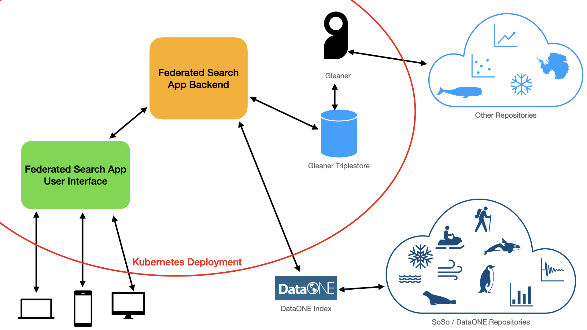

# POLDER Federated Search

A customizable federated search website, originally created for the polar research community. The POLDER Federated Search was originally developed by the World Data System International Technology Office (https://wds-ito.org/) between 2021-2023 in response to needs identified by the POLDER Working Group (http://polder.info). The intentions behind creating it are to have something that came from, and is meant to serve, an international community of polar (Arctic and Antarctic) researchers. We hope to build an easy to use, fast, accessible site that is tailored to this specific community and responds to its needs.

## Where can I use it?
Try out the latest release on the POLDER website: [https://search.polder.info](https://search.polder.info).

## Whose data is included in it?
There are four ways for your data repository to be included in the POLDER Federated Search:

1. If your data is being indexed by [DataONE](https://www.dataone.org/), you're in! POLDER Federated Search automatically searches DataONE's index.

1. If your data is included in the [NASA Global Change Master Directory's Common Metadata Repository](https://cmr.earthdata.nasa.gov/search), we can index it easily, given your data center ID. Please get in touch with us, so we can add you.

1. If you're able to add JSON-LD metadata to your data sets and follow the [POLDER schema.org best practices](https://docs.google.com/document/d/1r4OSRuVBfdJpMbyhjkhghHSeckraFEhxs0f1ld4aGkg) (note: this document is still in progress) for your dataset metadata, all you have to do is provide us with a sitemap link so that POLDER Federated Search can harvest your metadata. [Read more](inclusion-guidelines) about what this involves.

1. If you or your team don’t have the capacity to complete the schema.org mark-up we can add you to the list of repositories to receive one-on-one development help from us so that we can help you meet the schema.org guidelines and get your data included

## How does it work?

The POLDER Federated Search website is a web application that consists of several different parts. On the internet, it's running in a [Kubernetes](https://kubernetes.io) cluster, using a [Helm](https://helm.sh) deployment. Everything inside the red boundary below is a dependency that runs inside the cluster, so that the parts can all interact with each other.

### The User Interface
Pictured in green on the diagram above, this is the website that people interact with in order to make searches and see search results. This is built in HTML, JavaScript and SCSS, using [Parcel](https://parceljs.org/). It has been tested for compliance with [WCAG standards](https://www.w3.org/WAI/standards-guidelines/wcag/) and usability with screen readers, browsers that do not support JavaScript, and mobile devices.

### Searches
A federated search is something that searches multiple indexes of data in order to collate and present results to people who want to find them. Accordingly, this site harvests metadata from several data repositories in order to search for datasets (represented by the light blue shapes in the diagram). It also sends search requests directly to DataONE, which does its own indexing (represented by the dark blue shapes in the diagram).

### Indexing
For the data repositories that this app indexes itself, POLDER Federated Search uses its own installation of [Gleaner](https://gleaner.io), which in turn stores metadata in Blazegraph. The backend sends searches to Blazegraph in order to search the repositories that POLDER Federated Search indexes.

### The Backend (what ties this all together)
Pictured in orange above, the web app itself that hosts the UI and does the searches is built using [Flask](https://flask.palletsprojects.com), which is a Python web framework. I chose Python because Python has good support for RDF and SPARQL operations with [RDFLib](https://rdflib.dev/). It takes in the search terms and facets that people want to look for, turns those into the appropriate queries, sends them to the search endpoints, gets results back from the searches, and turns those search results into something that can be displayed in the user interface.

